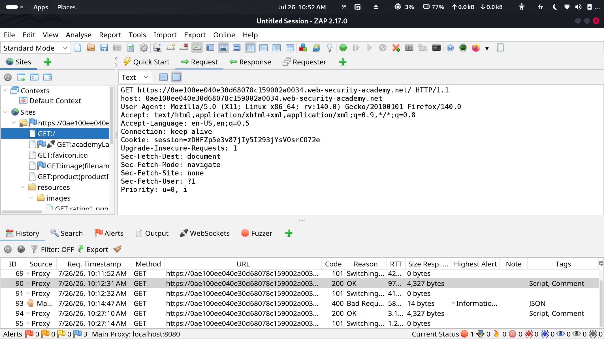
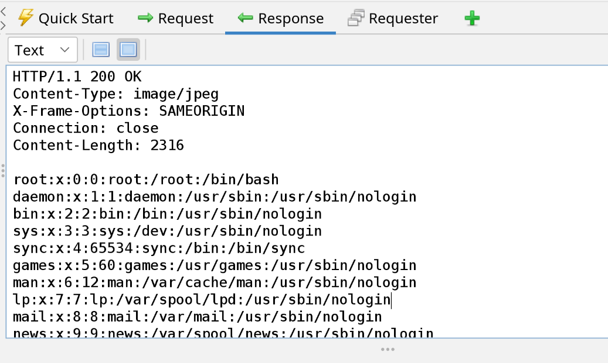
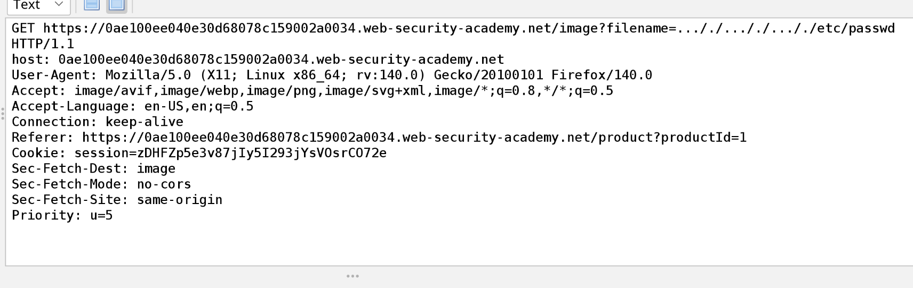
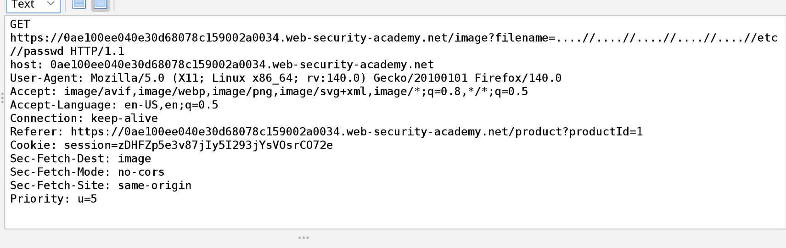
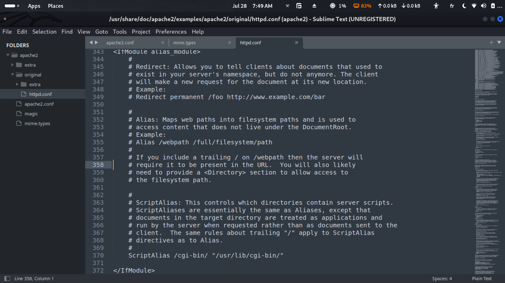
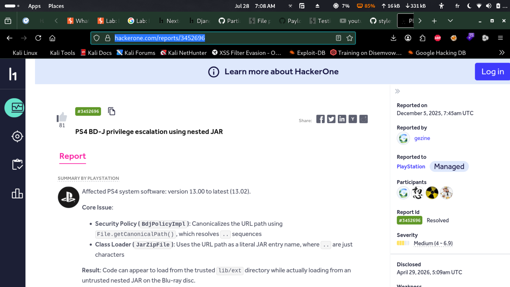

> [!Note]+
> Following a bug bounty hunting roadmap from voorivex team, 	reached the phase of learning Apache and Nginx servers fundamentals.

Choosed to get a bit of theory about both, how to setup, how to configure, and how to deploy in the simplest form of servers and applications. Then moving straightforward to practice on labs and challenges related to servers.

## Table of contents

## Portswigger File path traversal, simple case & File path traversal, traversal sequences blocked with absolute path bypass Labs :

  simple and basic enough to not be mentioned in this article.

## Portswigger File path traversal, traversal sequences stripped non-recursively:

In this lab, the vulnerable parameter still the same filename= used in the first labs, but this time can not be bypassed by just writing the accumulated path or absolute path like : ../../../../etc/passwd or /etc/passwd.

I tried to exploit the vulnerability as black box, so i didnt focus on the title of the lab, and started approaching it as in real world.

I tried all possibilities and payloads i do have according to my level of knowledge and they were basic enough so they got sanitized and didnt make any effect (url encoding / double encoding / base64 encoding).

Took a look on payloadallthethings repository, and grabbed some of the payloads, and they didnt work. 

I found there a tool (dotdotpwn), but seemed too old, didnt installed it, looked for another PathSeeker, didnt get anything useful because of its limited wordlist.

I Researched for wordlists, and i found a bunch including dotdotpwn's wordlist.

The obstacle after this was with burpsuite community and turbo intruder limitations in sending conccurrent requests since the wordlist was huge (high number of failures and retries of connection) .

So came the time to take a look and learn in my way the ZAPROXY, it was incredible literally. Open-source and maintained by community 

I have installed it, learned the basic usage, and started poking at the host

Then i used their free Fuzzer tool, and i was amazed, it was incredibly fast with zero errors and of course totally FREE ^-^. Loaded the dotdotpwn (21144 entries), in a short period it got a 200 response by the successful payload at the line 6489.

The payload was : ..././..././..././etc/passwd

The back-end here was running a function like removing an occurence of '../' at a time,
so when it faces .../ it removes ../ and leaves . a dot ,
and when it faces ./ it does nothing, 
so the above payload passed next as:
../../../etc/passwd

Then the pattern in the next entries of wordlist were like : 4dots//4dots//4dots//FILEPATH

The server failed at sanitizing the traversal sequences recursively, letting the pattern to be like : ../../../../FILEPATH.

## File path traversal, traversal sequences stripped with superfluous URL-decode

In this lab, the sanitization of user-supplied input was like the following:
    - A function takes the user input passed to the parameter filename
    - Applies a url decoding on it for one time
    - Then checks if there are directory traversal sequences
    - If yes, then the sequences will be deleted and passed to next code lines for processing.
    - If no, the input is kept as it is and passed to further code parts.

The problem in this flow was in the one-time url decoding, while it succeeds in sanitizing payloads with one time url encoding, it still fails at double encoded payloads.
But the real issue wasnt only this one-time url decoding, since if a double-encoded payload like ..%252F..%252F..%252F..%252Fetc%252Fpasswd decoded and passed as ..%2F..%2F..%2F..%2Fetc%2Fpasswd, the webserver in the background wont recognize that and returns "No such file" response.      
The trajedy was in another part of code later on that was decoding again and without a traversal sequence sanitization, so the left payload ..%2F..%2F..%2F..%2Fetc%2Fpasswd will be decoded superfluously to be ../../../../etc/passwd and passed to the server revealing the path content.

## Playing with local installed Apache 
I found a cve that was affecting Apache 2.4.49/50, i took the assist of AI, to replicate the cve.
The cve was about a url decoding function in the apache failed at sanitizing a multi-format traversal payload that consists of two representations for the dot symbol like this .%2e/.%2e/.%2e/.%2e/.%2e/.%2e/etc/passwd, a part of the function when facing Unicode format of the dot it stops at the first occurence of the Unicode format and skips the check, so it doesnt validate the whole decoded payload.
Besides that the requirements for this cve, is that the directory directive must be "require ALL granted" or absent in the apache2/httpd.conf file, plus the Alias-like directive configured to local directories that can be mapped using web urls.
So in my case:

the payload : localhost:1234/.%2e/.%2e/.%2e/.%2e/.%2e/.%2e/etc/passwd FAILS     
the payload : localhost:1234/cgi-bin/.%2e/.%2e/.%2e/.%2e/.%2e/.%2e/etc/passwd SUCCEEDS

## File path traversal, validation of start of path

Portswigger shows in this lab, a common mistakes that really happens in the wild, which i found in disclosed reports like this one in PlayStation bug bounty program : https://hackerone.com/reports/3452696   
The issue here is validating a user-supplied input by checking if it starts with a trusted path, as the path in the lab was /var/www/images
payload used was simple: /var/www/images/../../../../etc/passwd
