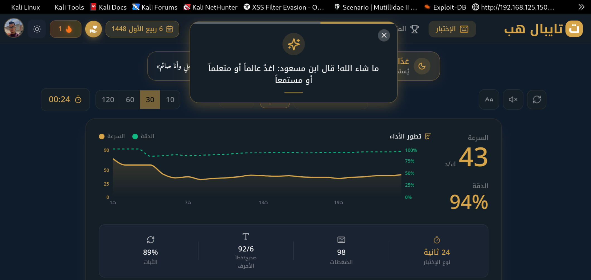

**بوعصيدة برهان الدين**

📍 بريش، أم البواقي، الجزائر ·

✉️ goldenbourhane@gmail.com

## Table of contents

## نبذة مهنية

> محترف متعدد المهارات يجمع بين خبرة إدارية صلبة ومهارات تقنية في Linux وWindows والشبكات وتطوير الويب. سريع في الكتابة ودقيق في إدارة البيانات، يواصل حالياً تكوينه المعمّق في مجال الأمن السيبراني. حاصل على ليسانس في اللغة الإنجليزية وشهادة Cisco Networking Fundamentals، يجمع بين سهولة التواصل والقدرة على التكيف السريع مع البيئات التقنية المتطلبة.

## المهارات الأساسية

| المجال | التفاصيل |
|---|---|
| **أنظمة التشغيل** | Linux (أساسيات الإدارة)، Windows (التثبيت، الإعداد، استكشاف الأخطاء وإصلاحها) |
| **الشبكات** | مفاهيم أساسية في الشبكات — حاصل على شهادة *Cisco Networking Fundamentals* |
| **الويب / البرمجة النصية** | HTML، CSS، JavaScript، Python |
| **الأمن السيبراني** | قيد التعلم — الأساسيات، ثغرات تطبيقات الويب، تدقيق تطبيقات الويب |
| **المكتبية والإدارة** | كتابة سريعة ودقيقة، إدخال البيانات، إدارة المستندات، إدارة التذاكر/الطلبات |
| **اللغات** | الإنجليزية (طلاقة)، العربية (اللغة الأم)، الفرنسية (أساسيات) |
| **المهارات الشخصية** | التواصل، الاهتمام بالتفاصيل، حل المشكلات، إدارة الوقت، التكيف، التعلم السريع |

---

## التعليم

### ليسانس في اللغة الإنجليزية
**قسم الآداب واللغة، جامعة العربي بن مهيدي بأم البواقي**
*جوان 2024*

---

## الشهادات

### Cisco Networking Fundamentals
**أكاديمية Cisco للشبكات** — *11 أفريل 2026*

- رابط الشهادة: https://www.credly.com/badges/842cb783-a48c-4397-80b1-920e80e94b7a

---

## الخبرة المهنية

### متدرب في مركز التكوين المهني والتمهين ببريش
*تقريباً [04/2025] – [05/2025] (شهر واحد)*

المهام والوظائف:
- المساعدة في معالجة المستندات والأرشفة الإدارية
- تكفل بإدخال البيانات وإدارة الملفات
- دعم العمليات اليومية للمكتب والتواصل مع الموظفين/الزائرين

---

## المشاريع

### إنشاء تطبيقات ويب
- رابط لمجلد Google Drive يحتوي على تطبيقات ويب (لسطح المكتب، وليس للهاتف) قمت بإنشائها:

    https://drive.google.com/drive/folders/1NWGDjGqL5jnY1dcxSGtk_7NmoI7AqIim?usp=sharing

### مشاريع بسيطة بلغة Python:
- مجلد يحتوي على روابط لمشاريع Python متنوعة
    https://drive.google.com/drive/folders/1JAOW5FWYL7knEj-kNobILvoM2yucqfKv?usp=sharing

### مزيج من معرفة Linux مع برمجة Python
وصف موجز: ما يقوم به، الأدوات/التقنيات المستخدمة، النتيجة

---

## معلومات إضافية

- سرعة كتابة عالية (60 كلمة في الدقيقة بالإنجليزية / 40 كلمة في الدقيقة بالعربية)
.png>)

- أتمتة أساسية بالذكاء الاصطناعي باستخدام Claude وGemini وChatGpt وZ.ai
- يواصل بنشاط مساراً مهنياً في الأمن السيبراني